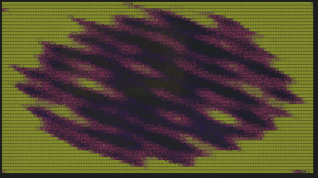

<div align="center">


**spektr** — a terminal spectrum analyser for whatever your speakers are doing.

[](https://www.python.org/)
[](https://github.com/MrEmoji27/spektr/blob/main/LICENSE)
[](#how-it-captures-audio)
[](#modes)
[](#themes)
[](https://textual.textualize.io/)

<!-- ── HERO ─────────────────────────────────────────────────────────────────
     Drop the demo here. Both forms below render on GitHub; keep whichever
     one you record and delete the other.

     A) GIF committed to the repo (autoplays, no controls, no sound):
        

     B) MP4/WebM (plays with controls, keeps sound, no repo weight): open a
        new issue on the repo, drag the file into the comment box, copy the
        https://github.com/user-attachments/... URL it produces, close the
        issue without posting, then paste that URL on its own line here.

     Recording notes, so the hero reads well at README width:
       · terminal ~100x28, one theme change every few seconds, `f` for
         full-screen (no header/footer) and `s` for shuffle on `both`
       · 12-15 fps is enough for a GIF and roughly halves the file next to 30
       · keep it under ~8 MB and under ~20 s; GitHub will render more, but a
         cold page load will not
       · width="900" matches the README's content column
     ────────────────────────────────────────────────────────────────────── -->

</div>

Point it at nothing. Play music anywhere — Spotify, a browser tab, a game, a call — and
spektr draws it: overlapped FFTs across 32 log-spaced bands (settable) from 50 Hz to 10 kHz, laid
out the way cava does it, rendered with braille sub-characters so the picture moves at
four times the vertical resolution of a text cell.

**Fifty-two render modes. Fifty-five themes. 60 fps, or your display's.**

There is an **Android build** too — the same engine, on a tablet, as an ambient
display for the desk. It is a second screen, not a second product: see
[spektr on Android](#spektr-on-android).

## Install

> [!TIP]
> **Windows, no Python required** — grab `spektr.exe` from the
> [latest release](https://github.com/MrEmoji27/spektr/releases) and double-click it.
> A black window opens with the visualiser in it; that's a terminal, and it's meant to
> happen. Windows may warn that it doesn't recognise the app — **More info → Run anyway**;
> the build is unsigned because certificates cost money. There's an installer in the same
> release if you'd rather have a Start Menu entry and a faster start.

> [!TIP]
> **Linux, no Python required** — grab the `spektr` binary from the same
> [latest release](https://github.com/MrEmoji27/spektr/releases), make it executable, and
> run it from a terminal (it's a terminal program):
>
> ```bash
> chmod +x spektr
> ./spektr
> ```
>
> You'll need the system audio libs it loads at run time: `libpulse.so` (PipeWire provides
> it via `pipewire-pulse`) and PortAudio. Arch: `sudo pacman -S portaudio`. Debian/Ubuntu:
> `sudo apt install libportaudio2`. Fedora: `sudo dnf install portaudio`. spektr tells you
> if any are missing. The Windows `spektr.exe` in that release **will not run on Linux** —
> it's a Windows binary; use the `spektr` file instead.

**With Python 3.10+ (works on Windows, Linux and macOS)** — from source:

```bash
git clone https://github.com/MrEmoji27/spektr
cd spektr
pip install -e .
spektr
```

> [!NOTE]
> A one-line install is on the way in a later release. It won't be under the
> name `spektr` — that belongs to an unrelated project on PyPI — so the package
> name gets announced along with it. Until then use a prebuilt binary above, or
> the source install here.

On Windows you can also just double-click `start.bat`, which builds a private
environment on first run and starts spektr on every run after.

No configuration, no file to point it at, no music service to log into. It finds your
output device, taps it, and draws.

The header shows what's playing when it can — spektr only ever taps raw audio, so track
title/artist comes from the OS media session instead (System Media Transport Controls on
Windows, MPRIS on Linux), the same source your lock screen and media keys already use. No
session, no supported player, or an unsupported platform (macOS) all just fall back to the
usual capture status — never an error.

---

**Contents** · [Modes](#modes) · [Themes](#themes) ·
[Plugins](#plugins) · [Keys](#keys) · [Command line](#command-line) ·
[Audio capture](docs/audio-capture.md) · [How it works](docs/how-it-works.md) ·
[Development](docs/development.md) · [Inspired by](#inspired-by)

---

## Modes

<!-- ── MODE GALLERY ─────────────────────────────────────────────────────────
     Optional second recording: `assets/modes.gif`, the picker being arrowed
     through with the preview updating live. Shows the range in one shot in a
     way a table of names cannot.

        

     Same recording notes as the hero above. `v` opens the picker; hold the
     down arrow rather than pressing it, so the preview has time to settle on
     each mode.
     ────────────────────────────────────────────────────────────────────── -->

Press `v` for a filterable picker that previews each one live as you arrow through it.
Listed in the order the picker cycles them.

| | | | |
|---|---|---|---|
| **Bars** | the classic — bars with peak markers | **Keys** | a lit keyboard; struck bands scroll away as notes |
| **Bricks** | chunky, no partial cells | **Tunnel** | flying down a pipe, ribbed by the beat |
| **Columns** | gapless, interpolated across the full width | **Tunnel In** | rings thrown out of the centre on the beat, rushing past you |
| **Ladder** | segmented LED stack | **Warp** | starfield, accelerating with the music |
| **Mirror** | grows out from the centre line | **Matrix** | digital rain, falling faster when it's loud |
| **Readout** | scrolling numeric ticker, band levels as plain digits | **Boot** | an old PC waking up — BIOS POST, a boot log, a blinking cursor |
| **Stereo** | per-band L/R meters, mirrored from centre | **Spectro** | scrolling waterfall — frequency up, time across |
| **Wave** | smoothed waveform | **Plasma** | solid colour field, warped by the spectrum |
| **Scope** | trigger-synced oscilloscope — the trace holds still | **Chladni** | vibrating-plate figure that snaps between real resonances |
| **ECG** | scrolling trace, like a heart monitor | **Chladni Flow** | the same plate, melting continuously from one figure to the next |
| **Strings** | plucked strings, bowed by their own band | **Chladni Extreme** | the plate driven past its modes — morphs and escalates |
| **Helix** | two strands rotating, split by true L/R phase | **VFD** | vacuum-fluorescent bargraph with phosphor afterglow |
| **Gonio** | stereo phase scope with a phosphor trail | **Needle** | analogue VU — one sweeping needle, one red zone |
| **Scatter** | density sparkle, thicker where it's loud | **VU** | big L/R LED meters with peak hold |
| **Flame** | fire, licking upward from each band | **Kaleidoscope** | radial mirror symmetry — the wedge count follows the spectrum |
| **Pulse** | radial pulse with shockwaves | **Dither** | the spectrum printed as a newspaper halftone |
| **Arcs** | hollow rings, one per band, pushed out by level | **Dither Storm** | the same crosshatch, but moving — each band drives its own wave, and beats throw rings through it |
| **Bubbles** | bubbles from the low end, popping at the top | **Dither Storm Extreme** | Dither Storm with nothing holding it back — hits pile up and a dense passage blows the field to white |
| **Radial** | the spectrum wrapped into a circle | **Valentine** | a heart that beats with the track, trailing smaller ones upward |
| **Sonar** | one sweep, not the whole spectrum — returns fade like a scope | **Locket** | an outlined heart, pulsing rings of hearts outward on the beat |
| **Orbit** | bodies on real elliptical orbits; loud bands swing out | **Shooting Star** | a night sky, with meteors thrown from a drifting radiant on the beat |
| **Fireworks** | beat-triggered launches, bursts, and fall | **Maelstrom** | a real fluid sim, stirred by the music |
| **Dune** | sand piles up by band, avalanching past a threshold | **Vinyl** | a record whose grooves light up as a radial spectrum |
| **Murmuration** | a flock wheeling and scattering with the beat | **Rain** | rain on the glass, falling harder when it's loud |
| **Retro** | sunset grid, with the spectrum as the horizon | **Ember** | a coal bed burning by band, sparks off the hot spots |
| **Auroras** | a light ribbon whose lower rim rides the spectrum | **Snow** | snowfall in three planes, gusting and lying in drifts |

**Shooting Star** opens a *cosmos* group, and it is built on a different
bargain from everything above it: the picture is mostly empty and mostly
still, and the music arrives as events rather than as a level being redrawn.
The meteors come from a drifting **radiant**, the point a real shower appears
to diverge from, and a harder onset throws a brighter, longer, faster one.

Vinyl, Rain, Snow and Ember are the lofi group — a
shared *look* (warm objects, soft edges, nothing strobing) rather than a
shared reactivity budget. Each one maps real band data into its geometry,
so what the music changes is what the object is doing, not just how bright
the picture is.

A fifty-third entry, **None**, is registered as the off switch — it draws nothing.
That is why the test output counts 53 against the fifty-two listed here — and 65
in total, because the twelve subcell variants below are registered whether or not
the setting that offers them is on.

### Subcell variants: `(o)` and `(q)`

Twelve modes have a second version that draws with **subcell glyphs** — one text
cell split into eight or four addressable pieces instead of being a single
block. A nodal line or a scope trace then lands *inside* a cell rather than on
its boundary, which is the difference between a curve and a staircase.

They are **off by default**. Open Settings (`c`) and turn on **subcell modes** to
put them in the `v` picker:

| variant | what the extra resolution buys |
|---|---|
| **Scope (o)**, **ECG (o)**, **Sonar (o)**, **Radial (o)** | the trace becomes a continuous stroke instead of separated dots |
| **Plasma (o)**, **Chladni (o)**, **Chladni Flow (o)**, **Chladni Extreme (o)** | nodal lines and gradients resolve between cells rather than on them |
| **Kaleidoscope (o)**, **Kaleidoscope Ultra (o)** | mirror seams stop landing on cell edges |
| **Valentine (o)**, **Maelstrom (o)** | the rim of the shape gets four times the vertical resolution |

The suffix says **which glyphs the mode is drawing with**, and that is a
setting rather than a property of the mode — the **subcell shape** row in
Settings switches all of them at once:

- **`(o)` — octants.** 2x4 pieces per cell, from Unicode 16. The default, and
  what the modes are designed around. Needs a font that has them; run
  `spektr --glyph-test` and you will know in two seconds.
- **`(q)` — quadrants.** 2x2 pieces, from Block Elements, which every terminal
  font has had for decades. The fallback that always works.

So the same mode shows as `Chladni (o)` or `Chladni (q)` depending on that
setting, and both spellings are accepted anywhere a mode is named. Quadrants
are **not** a downgrade in speed — they are faster on the smooth field modes
and slower on the silhouette ones. Pick by what your font can draw.

At a normal terminal size the variants cost about what the originals do. Only
at a maximised window on a large screen does the difference show, and the
heaviest of them is Chladni Extreme.

Still frames of a few of them, straight from the render path: **[docs/gallery.md](https://github.com/MrEmoji27/spektr/blob/main/docs/gallery.md)**.


## Themes

Fifty-five built in, previewed live from the `t` picker: `classic`, `gruvbox`, `catppuccin`
(+`-latte`), `dracula`, `nord`, `tokyo-night` (+`-day`), `rose-pine`, `everforest`,
`kanagawa`, `ayu-mirage`, `monokai`, `solarized`, `nightfox`, `oxocarbon`, `miasma`,
`osaka-jade`, `ristretto`, `flexoki-light`, `nightfly`, `material`, `gotham`, `oceanic`,
`gruvbox-light`, `hackerman`, `ember`, `ethereal`, `synthwave`, `blade-runner`,
`nostromo`, `plasma`, `viridis`, `ice`, `vaporwave`, `infrared`, `deep-sea`, `magma`,
`matte-black`, `vantablack`, `rainbow`, `phosphor-amber`, `sakura`, `toxic`, `copper`,
`polar`, `bubblegum`, `hot-pink`, `ruby`, `emerald`, `sapphire`, `amethyst`, `citrine`,
`tangerine`, `indigo` — plus `auto`, which derives a ramp from whatever Textual theme your
terminal is wearing.

`rainbow` is animated — its colour loop drifts continuously across the bands instead of
sitting still, closing red → yellow → green → blue → violet → magenta back to red so the
flow has no seam to jump at.

Gradients are blended in linear light rather than straight sRGB, so the midpoint of a
ramp doesn't go muddy the way naive hex interpolation does. The terminal background is
painted with the theme's own `bg`, so a dark theme is dark whatever your terminal is set
to rather than showing through it.

### Custom themes

Drop a TOML file in `~/.config/spektr/themes/` (`%APPDATA%\spektr\themes\` on Windows).
The filename becomes the theme name; press `r` to reload without restarting.

```toml
# ~/.config/spektr/themes/solarized.toml
low    = "#859900"   # bottom of the spectrum ramp
mid    = "#b58900"
high   = "#dc322f"   # top
bg     = "#002b36"
fg     = "#839496"
accent = "#268bd2"
```

cliamp's `green`/`yellow`/`red`/`bright_fg` key names are accepted as aliases, so themes
port across without editing.

## Plugins

Your own visualizers, in `~/.config/spektr/plugins/`. They appear in the `v` picker
alongside the built-ins, because they use the same decorator and the same contract:

```python
# ~/.config/spektr/plugins/nightrider.py
import numpy as np
from spektr.api import mode, pack_braille, cell_max

@mode("Nightrider", blurb="scanning eye, swept by the beat")
def nightrider(ctx):
    speed = 0.5 + ctx.range(0.0, 0.15) * 2.5      # lunges on the kick
    pos = (np.sin(ctx.t * speed) * 0.5 + 0.5) * (ctx.dot_cols - 1)
    x = np.arange(ctx.dot_cols)[None, :]
    y = np.arange(ctx.dot_rows)[:, None]
    band = np.abs(y - (ctx.dot_rows - 1) / 2) < ctx.dot_rows * (0.12 + ctx.energy * 0.25)
    glow = np.clip(1.0 - np.abs(x - pos) / (ctx.dot_cols * 0.18), 0.0, 1.0)
    field = np.where(band, glow ** 1.6, 0.0)
    return pack_braille(field > 0.10), ctx.ramp(cell_max(field))
```

You return codepoints and *heat* — never colours — so every plugin works with all
fifty-five themes for free.

> [!WARNING]
> **Plugins are Python and run with your privileges.** spektr can't sandbox them, and
> won't pretend to. Instead the trust decision is explicit: a plugin doesn't run until
> you've approved its exact contents, and any edit invalidates that.

```console
$ spektr plugins list
  nightrider   untrusted  —

$ spektr plugins trust nightrider
  sha256  f28ceb19b2d630bd…   (31 lines)
  This is Python. It runs with your privileges. Read it first.
  Trust this plugin? [y/N] y
```

Failure *is* contained: a plugin that raises gets quarantined after a few attempts
rather than taking the app down, one that renders too slowly has its previous frame
reused, and its output is shape-checked so a mistake names the plugin instead of
crashing somewhere unrelated. `spektr plugins doctor` explains anything that didn't
load; `--no-plugins` starts clean.

Full guide, including the whole of `ctx` and the drawing toolkit: **[docs/plugins.md](https://github.com/MrEmoji27/spektr/blob/main/docs/plugins.md)**.

## Keys

| Key | Action | | Key | Action |
|---|---|---|---|---|
| `v` | Visualizer picker — live preview, `/` filter | | `d` / `D` | Next audio source / back to the default |
| `t` | Theme picker — live preview, `/` filter | | `s` | Shuffle on/off — set what it cycles in `c` |
| `c` | Settings — frame rate, bands, sensitivity, gate, source | | `[` `]` | Sensitivity down / up |
| `m` / `space` | Next mode (`M` for previous) | | `g` `G` | Noise gate down / up |
| `T` | Next theme | | `r` | Reload themes and plugins from disk |
| `f` | Hide header and footer — full-screen visual | | `q` | Quit |
| `p` | Frame time and FPS | | `h` / `?` | Help — every key, plus where the files live |
| `L` | Save the current mode + theme + settings as a preset | | `l` | Load a saved preset — live preview, `esc` restores |

Mode, theme, frame rate, band count, sensitivity, gate, and shuffle with its scope are remembered between runs.
Presets are separate — named snapshots you save on purpose, picked back up with `l`.

`c` opens a settings panel in the same shape as the pickers — arrow keys change values
and everything applies live, because a settings screen you have to close to see the
effect of is one you fight with. **Bands** is one control over two mechanisms: at or
below the analyser's native 32 the modes simply draw fewer bars out of the same
analysis, and above it the band plan is rebuilt so 48 or 64 bars are genuinely 48 or 64
distinct ranges of FFT bins rather than interpolated copies of their neighbours. **Source**
is the last row — it shows what's currently listening, refreshing on its own as a switch
settles rather than only when you touch it; → cycles to the next candidate device (same as
`d`), ← resets to the system default (same as `D`).

**Shuffle** is two things: `s` switches it on and off, and the `c` panel sets what it
cycles — `modes`, `themes` or `both`. The scope is remembered while it's off, so `s` picks up
where you left it. With `both` the mode changes every 15 s and the theme every third change,
staggered because new shapes and new colours in the same instant read as the picture breaking.
With `themes` alone there's no mode change to stagger against, so the theme moves every tick.

The **theme editor** row in `c` opens an editor on whatever is currently showing. Same panel shape, same live
application — the visualiser is running behind it with real audio, so you judge a colour by
watching bars move in it rather than by looking at a swatch. Pick a slot on the top row,
then nudge its hue, saturation and lightness. Four slots by default (`low`, `mid`, `high`,
`accent`) with the background and text colour derived from them; the `slots` row unlocks
those two for hand-picking, seeded from what was being derived so nothing jumps. A `check`
row runs the same visibility rule the test suite applies to the built-in themes — anchors
too close to their own background, text below WCAG AA — as a warning, not a veto. `esc`
asks for a name and writes `<config>/themes/<name>.toml`; a name that already exists gets a
numeric suffix rather than shadowing a built-in. `esc` at the name prompt throws the draft
away and restores the theme you started from.

## Command line

```
spektr --diagnose       probe every source: is audio arriving, and how loud?
spektr --devices        list every audio device
spektr --device 7       force a capture device by index
spektr --mode Retro     start in a given visualiser
spektr --theme gruvbox  start with a given theme
spektr --fps 30         cap the frame rate (15-240)
spektr --fps unlimited  run at the detected display rate (experimental)
spektr --mic            allow the microphone as an automatic source
spektr --list-modes     print visualiser names (including the opt-in ones)
spektr --list-themes    print theme names
spektr --glyph-test     can this terminal draw the (o) subcell modes?
spektr --cells quadrant draw the subcell modes as (q) — block elements only
spektr --monitor        run the capture path headlessly, when --diagnose looks fine
                        but the picture will not move
spektr --no-plugins     skip loading plugins this run
spektr --version        print version

spektr plugins list     what's installed, and whether it's trusted
spektr plugins trust    review and approve a plugin
spektr plugins doctor   why isn't mine loading?
spektr plugins path     print the plugins folder
```

## How it captures audio

spektr listens to your **output** device via loopback, so it visualises whatever is
already playing — it never needs a file, a stream, or a music service. Stereo is
preserved end to end, which is what the Stereo, VU, Needle and Gonio modes read.

| Platform | Status |
|---|---|
| **Windows** | WASAPI loopback via `soundcard` — works out of the box |
| **Linux** | PulseAudio / PipeWire monitor via `soundcard`, or a monitor input |
| **macOS** | Needs a loopback device (BlackHole, Soundflower) |

It taps whatever the OS calls your default output and stays there, and it will never pick
your microphone on its own. If the display is flat, `spektr --diagnose` opens every
candidate in turn and prints the measured RMS and peak for each, which settles it.

Why loopback needs `soundcard` rather than `sounddevice`, why the tap doesn't audition
devices for signal, and how to read `--diagnose`:
**[docs/audio-capture.md](docs/audio-capture.md)**.

## spektr on Android

<details>
<summary><b>An ambient display for a tablet you already own.</b> Same engine, same
modes, same themes — click to expand.</summary>

<br>

<!-- ── ANDROID ──────────────────────────────────────────────────────────────
     Optional: `assets/android.gif`, filmed off the tablet rather than
     captured, so the point lands — this is a screen on a desk, not a
     screenshot. Landscape, propped up, music audibly playing from it.

        
     ────────────────────────────────────────────────────────────────────── -->

**What it is for.** A spare screen that draws your music. It is best on a big
one — a tablet propped on the desk, an old phone in a stand, anything you are
going to *look at* rather than hold. This is decoration, and it is meant to be:
there is nothing here you cannot do better on the desktop, and no reason to run
it on the device you are actually using. Where it earns its place is a
multi-device setup — laptop for the work, tablet beside it doing nothing else.

**What it captures.** Whatever *that device* is playing. Android has no way for
one device to read another's audio, so the tablet visualises the tablet: put
the music on it and let the desktop get on with the work. It cannot draw what
your PC is playing, and no Android app can.

The permission prompt asks to record the screen. That is Android's doing, not
ours — `AudioPlaybackCapture` is part of the screen-recording API and there is
no audio-only consent to ask for. Nothing is recorded and nothing leaves the
device; the capture is read straight into the analyser and thrown away.

**How it works.** The engine is the same Python you are reading about above,
running unmodified on the device through
[Chaquopy](https://chaquo.com/chaquopy/): CPython and numpy load in about half
a second, and one call per frame crosses into Kotlin carrying a packed grid of
codepoints and colour indices. Kotlin owns the audio and the screen; everything
between them is this repository.

That means a mode written for the terminal works on the phone the day it is
written, and a theme is the same fifty-five colours in both places. It also
means the port inherits the terminal's shape — a grid of character cells —
which is why the settings sheet has a **detail** row: how many rows of cells
fit on the screen is the one number that decides how coarse everything looks.

**Where it differs.**

| | desktop | Android |
|---|---|---|
| modes | 64 | 52 — the twelve `(o)` variants need Unicode 16 octants, which no font on Android has yet |
| themes | 55 | 55 |
| frame rate | 60 | 30, and the panel is watched from across a room |
| rendering | terminal cells | cells, or **smooth** — the field blitted as a picture instead of typeset as glyphs |

**Smooth** is the one thing the phone can do that a terminal cannot. A cell is
not a pixel: Chladni computes a continuous field and then picks one half-block
to stand for each cell. Android has a canvas and no such constraint, so the
mode is run finer and the field it actually computed is drawn — curves instead
of staircases.

**Getting it.** `spektr-android-*-arm64-v8a.apk` on the
[releases page](https://github.com/MrEmoji27/spektr/releases). Android 10 or
newer, 64-bit ARM. Sideload it — you will need to allow installs from your
browser or file manager the first time.

The APK carries its own version number and it is not the one on the release.
The port has had fewer versions than the desktop app, so the build inside
spektr 0.4.0 reports **v0.2.0**; putting 0.4.0 on it would claim four versions
of something that has had two. `CHANGELOG.md` lists the Android versions
separately, and the app shows that same file under **what's new**.

Build it yourself with `cd android && ./gradlew :app:assembleDebug`; the
design notes are in [docs/android-port.md](docs/android-port.md).

</details>

## How it works

Analysis runs on its own 256-sample-hop clock rather than off the frame timer, the bands
use [cava](https://github.com/karlstav/cava)'s two-window distribution, the easing is
expressed in seconds so the motion is identical at 15 and 240 fps, and modes emit arrays
of codepoints and palette indices — never strings, never a Rich console render.

The reasoning behind each of those, and what breaks without it:
**[docs/how-it-works.md](docs/how-it-works.md)**.

## Development

```bash
python -m pytest tests/ -q   # the whole suite
python tests/bench.py        # shape checks, per-mode render benchmark, cost gate
python tests/onset_score.py  # scores the real onset detector against the corpus
python tests/test_audit.py   # logic audit: mutation, animation, reactivity, leaks
```

Benchmark method, what each gate actually gates, and their current state:
**[docs/development.md](docs/development.md)**. Building the Windows exe and installer:
**[packaging/README.md](https://github.com/MrEmoji27/spektr/blob/main/packaging/README.md)**.

## Why it exists

It began as the visualiser inside a terminal music client. It turned out to be the most
interesting part of that project and the only part that didn't depend on anyone's API,
so it moved out and got its own name.

## Inspired by

spektr is a terminal visualizer, and the two best ones were already written — so their
good ideas get cited here, where they belong.

- **[cava](https://github.com/karlstav/cava)** — the console audio visualizer that
  solved the hard parts of the spectrum first. spektr takes its band distribution
  (two FFT windows with strictly disjoint bins over 50 Hz–10 kHz), its
  overshoot-based automatic sensitivity, and its capture rule: tap whatever the OS
  calls the default output and don't audition for signal.

- **[cliamp](https://github.com/bjarneo/cliamp)** — the terminal music player that
  spektr began life inside. The mode registry, the theme system and the plugin
  contract all carry its shape: cliamp theme files port over unchanged (see
  [Custom themes](#custom-themes)), and the plugin model — code with a decorator,
  in a folder, vetted by hash before it runs — is the same idea in a different
  language.

## Use of AI in this project

Parts of spektr were developed with the assistance of AI. **Opus 5**,
**GPT-5.6 Luna** and **DeepSeek v4 Flash** contributed to building, debugging
and fixing the project. This is stated openly rather than left to be inferred
from the commit history.

They were used under human direction and within deliberate limits. No model
had authority over the project's direction, and no output was accepted merely
because it appeared complete. Contributions were reviewed, and — more
importantly — held to the same standards as anything else here: a change was
adopted once it had been measured, rendered, or otherwise demonstrated to do
what it claimed.

That requirement is not ceremony. Generated code fails in a particular way:
it is fluent, internally consistent, and confidently documented, and it can be
all of those things while being wrong. A visualiser mode can return arrays of
the correct shape, carry an articulate docstring, and still draw the wrong
picture. Reviewing such code by reading it is not sufficient, because reading
is precisely the check it is best at passing.

This is why the test suite here is shaped as it is. It verifies behaviour
rather than structure: that a mode responds when the audio changes and holds
still when it does not; that it uses the colour ramp it is given instead of
collapsing into a few shades; that a comment still describes the code beside
it; that the Android build's vendored copy of the engine matches the original;
that every glyph a mode emits exists in the font that ships with it. Most of
those checks were added after something had already passed a weaker one and
proved wrong regardless.

### A note for anyone doing the same

If you use AI while building software, the risk worth planning for is not poor
quality output — it is plausible output. Code that has not been read, executed
and tested is a liability regardless of its author, and adopting a model's
work because it looks reasonable is a reliable way to ship a defect that
cannot later be explained.

Treat generated code as a proposal rather than a result. Establish how a
change will be verified before accepting it, prefer checks that observe
behaviour over checks that inspect form, and keep a human accountable for
every decision. Used on those terms, these tools are genuinely useful. Used
without them, they transfer risk into the codebase quietly, which is the worst
place for it to arrive.

## License

MIT © zemo — see [LICENSE](https://github.com/MrEmoji27/spektr/blob/main/LICENSE).
