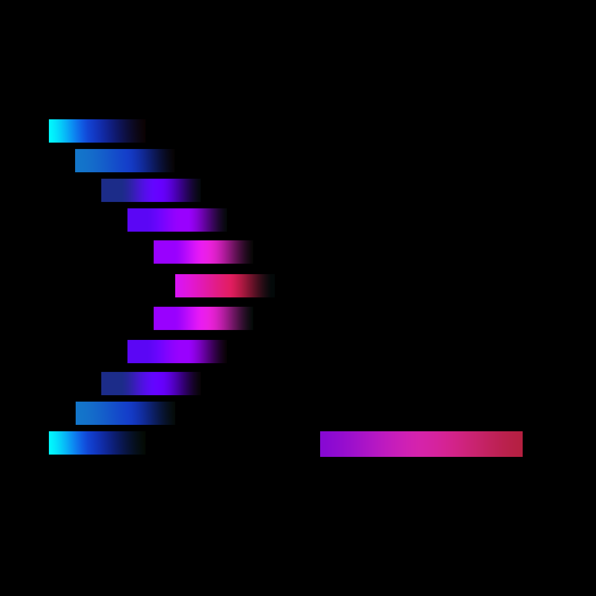

<div align="center">



**spektr** — a terminal spectrum analyser for whatever your speakers are doing.

[](https://www.python.org/)
[](LICENSE)
[](#how-it-captures-audio)
[](#modes)
[](#themes)
[](https://textual.textualize.io/)

</div>

<!-- Drop a screenshot or GIF in docs/ and point this at it:
      -->

Point it at nothing. Play music anywhere — Spotify, a browser tab, a game, a call — and
spektr draws it: overlapped FFTs across 32 log-spaced bands (settable) from 50 Hz to 10 kHz, laid
out the way cava does it, rendered with braille sub-characters so the picture moves at
four times the vertical resolution of a text cell.

**Twenty-nine render modes. Forty-seven themes. Locked 60 fps.**

## Install

> [!TIP]
> **Windows, no Python required** — grab `spektr.exe` from the
> [latest release](https://github.com/MrEmoji27/spektr/releases) and double-click it.
> A black window opens with the visualiser in it; that's a terminal, and it's meant to
> happen. Windows may warn that it doesn't recognise the app — **More info → Run anyway**;
> the build is unsigned because certificates cost money. There's an installer in the same
> release if you'd rather have a Start Menu entry and a faster start.

> [!TIP]
> **Linux, no Python required** — grab the `spektr` binary from the same
> [latest release](https://github.com/MrEmoji27/spektr/releases), make it executable, and
> run it from a terminal (it's a terminal program):
>
> ```bash
> chmod +x spektr
> ./spektr
> ```
>
> You'll need the system audio libs it loads at run time: `libpulse.so` (PipeWire provides
> it via `pipewire-pulse`) and PortAudio. Arch: `sudo pacman -S portaudio`. Debian/Ubuntu:
> `sudo apt install libportaudio2`. Fedora: `sudo dnf install portaudio`. spektr tells you
> if any are missing. The Windows `spektr.exe` in that release **will not run on Linux** —
> it's a Windows binary; use the `spektr` file instead.

**With Python 3.10+ (works on Windows, Linux and macOS):**

```bash
pip install spektr
spektr
```

Or from source:

```bash
git clone https://github.com/MrEmoji27/spektr
cd spektr
pip install -e .
spektr
```

On Windows you can also just double-click `start.bat`, which builds a private
environment on first run and starts spektr on every run after.

No configuration, no file to point it at, no music service to log into. It finds your
output device, taps it, and draws.

The header shows what's playing when it can — spektr only ever taps raw audio, so track
title/artist comes from the OS media session instead (System Media Transport Controls on
Windows, MPRIS on Linux), the same source your lock screen and media keys already use. No
session, no supported player, or an unsupported platform (macOS) all just fall back to the
usual capture status — never an error.

---

**Contents** · [Modes](#modes) · [Themes](#themes) ·
[Plugins](#plugins) · [Keys](#keys) · [Command line](#command-line) ·
[Audio capture](#how-it-captures-audio) · [How it works](#how-it-works) ·
[Development](#development) · [Inspired by](#inspired-by)

---

## Modes

Press `v` for a filterable picker that previews each one live as you arrow through it.
Listed in the order the picker cycles them.

| | | | |
|---|---|---|---|
| **Bars** | the classic — bars with peak markers | **Bubbles** | bubbles from the low end, popping at the top |
| **Bricks** | chunky, no partial cells | **Radial** | the spectrum wrapped into a circle |
| **Columns** | gapless, interpolated across the full width | **Retro** | sunset grid, with the spectrum as the horizon |
| **Ladder** | segmented LED stack | **Auroras** | light curtains, billowing on the treble |
| **Sonar** | one sweep, not the whole spectrum — returns fade like a scope | **Skyline** | a city at night, windows lit by their band |
| **Mirror** | grows out from the centre line | **Tunnel** | flying down a pipe, ribbed by the beat |
| **Stereo** | per-band L/R meters, mirrored from centre | **Warp** | starfield, accelerating with the music |
| **Wave** | smoothed waveform | **Matrix** | digital rain, falling faster when it's loud |
| **Scope** | trigger-synced oscilloscope — the trace holds still | **Spectro** | scrolling waterfall — frequency up, time across |
| **ECG** | scrolling trace, like a heart monitor | **Plasma** | solid colour field, warped by the spectrum |
| **Strings** | plucked strings, bowed by their own band | **VFD** | vacuum-fluorescent bargraph with phosphor afterglow |
| **Gonio** | stereo phase scope with a phosphor trail | **Needle** | analogue VU — one sweeping needle, one red zone |
| **Scatter** | density sparkle, thicker where it's loud | **VU** | big L/R LED meters with peak hold |
| **Flame** | fire, licking upward from each band | **Arcs** | hollow rings, one per band, pushed out by level |
| **Pulse** | radial pulse with shockwaves | | |

A thirtieth entry, **None**, is registered as the off switch — it draws nothing.
That is why the test output counts 30 modes against the twenty-nine listed here.

Still frames of a few of them, straight from the render path: **[docs/gallery.md](docs/gallery.md)**.

## Themes

Forty-seven built in, previewed live from the `t` picker: `classic`, `gruvbox`, `catppuccin`
(+`-latte`), `dracula`, `nord`, `tokyo-night` (+`-day`), `rose-pine`, `everforest`,
`kanagawa`, `ayu-mirage`, `monokai`, `solarized`, `nightfox`, `oxocarbon`, `miasma`,
`osaka-jade`, `ristretto`, `flexoki-light`, `nightfly`, `material`, `gotham`, `oceanic`,
`gruvbox-light`, `hackerman`, `ember`, `ethereal`, `synthwave`, `blade-runner`,
`nostromo`, `plasma`, `viridis`, `ice`, `vaporwave`, `infrared`, `deep-sea`, `magma`,
`matte-black`, `vantablack`, `rainbow`, `phosphor-amber`, `sakura`, `toxic`, `copper`,
`polar`, `bubblegum` — plus `auto`, which derives a ramp from whatever Textual theme your
terminal is wearing.

`rainbow` is animated — its colour loop drifts continuously across the bands instead of
sitting still, closing red → yellow → green → blue → violet → magenta back to red so the
flow has no seam to jump at.

Gradients are blended in linear light rather than straight sRGB, so the midpoint of a
ramp doesn't go muddy the way naive hex interpolation does. The terminal background is
painted with the theme's own `bg`, so a dark theme is dark whatever your terminal is set
to rather than showing through it.

### Custom themes

Drop a TOML file in `~/.config/spektr/themes/` (`%APPDATA%\spektr\themes\` on Windows).
The filename becomes the theme name; press `r` to reload without restarting.

```toml
# ~/.config/spektr/themes/solarized.toml
low    = "#859900"   # bottom of the spectrum ramp
mid    = "#b58900"
high   = "#dc322f"   # top
bg     = "#002b36"
fg     = "#839496"
accent = "#268bd2"
```

cliamp's `green`/`yellow`/`red`/`bright_fg` key names are accepted as aliases, so themes
port across without editing.

## Plugins

Your own visualizers, in `~/.config/spektr/plugins/`. They appear in the `v` picker
alongside the built-ins, because they use the same decorator and the same contract:

```python
# ~/.config/spektr/plugins/nightrider.py
import numpy as np
from spektr.api import mode, pack_braille, cell_max

@mode("Nightrider", blurb="scanning eye, swept by the beat")
def nightrider(ctx):
    speed = 0.5 + ctx.range(0.0, 0.15) * 2.5      # lunges on the kick
    pos = (np.sin(ctx.t * speed) * 0.5 + 0.5) * (ctx.dot_cols - 1)
    x = np.arange(ctx.dot_cols)[None, :]
    y = np.arange(ctx.dot_rows)[:, None]
    band = np.abs(y - (ctx.dot_rows - 1) / 2) < ctx.dot_rows * (0.12 + ctx.energy * 0.25)
    glow = np.clip(1.0 - np.abs(x - pos) / (ctx.dot_cols * 0.18), 0.0, 1.0)
    field = np.where(band, glow ** 1.6, 0.0)
    return pack_braille(field > 0.10), ctx.ramp(cell_max(field))
```

You return codepoints and *heat* — never colours — so every plugin works with all
forty-seven themes for free.

> [!WARNING]
> **Plugins are Python and run with your privileges.** spektr can't sandbox them, and
> won't pretend to. Instead the trust decision is explicit: a plugin doesn't run until
> you've approved its exact contents, and any edit invalidates that.

```console
$ spektr plugins list
  nightrider   untrusted  —

$ spektr plugins trust nightrider
  sha256  f28ceb19b2d630bd…   (31 lines)
  This is Python. It runs with your privileges. Read it first.
  Trust this plugin? [y/N] y
```

Failure *is* contained: a plugin that raises gets quarantined after a few attempts
rather than taking the app down, one that renders too slowly has its previous frame
reused, and its output is shape-checked so a mistake names the plugin instead of
crashing somewhere unrelated. `spektr plugins doctor` explains anything that didn't
load; `--no-plugins` starts clean.

Full guide, including the whole of `ctx` and the drawing toolkit: **[docs/plugins.md](docs/plugins.md)**.

## Keys

| Key | Action | | Key | Action |
|---|---|---|---|---|
| `v` | Visualizer picker — live preview, `/` filter | | `d` / `D` | Next audio source / back to the default |
| `t` | Theme picker — live preview, `/` filter | | `s` | Shuffle — random mode + theme on a timer |
| `c` | Settings — frame rate, bands, sensitivity, gate, source | | `[` `]` | Sensitivity down / up |
| `m` / `space` | Next mode (`M` for previous) | | `g` `G` | Noise gate down / up |
| `T` | Next theme | | `r` | Reload themes and plugins from disk |
| `f` | Hide header and footer — full-screen visual | | `q` | Quit |
| `p` | Frame time and FPS | | | |
| `L` | Save the current mode + theme + settings as a preset | | `l` | Load a saved preset — live preview, `esc` restores |

Mode, theme, frame rate, band count, sensitivity, gate and shuffle are remembered between runs.
Presets are separate — named snapshots you save on purpose, picked back up with `l`.

`c` opens a settings panel in the same shape as the pickers — arrow keys change values
and everything applies live, because a settings screen you have to close to see the
effect of is one you fight with. **Bands** is one control over two mechanisms: at or
below the analyser's native 32 the modes simply draw fewer bars out of the same
analysis, and above it the band plan is rebuilt so 48 or 64 bars are genuinely 48 or 64
distinct ranges of FFT bins rather than interpolated copies of their neighbours. **Source**
is the last row — it shows what's currently listening, refreshing on its own as a switch
settles rather than only when you touch it; → cycles to the next candidate device (same as
`d`), ← resets to the system default (same as `D`).

## Command line

```
spektr --diagnose       probe every source: is audio arriving, and how loud?
spektr --devices        list every audio device
spektr --device 7       force a capture device by index
spektr --mode Retro     start in a given visualiser
spektr --theme gruvbox  start with a given theme
spektr --fps 30         cap the frame rate
spektr --mic            allow the microphone as an automatic source
spektr --list-modes     print visualiser names
spektr --list-themes    print theme names
spektr --no-plugins     skip loading plugins this run

spektr plugins list     what's installed, and whether it's trusted
spektr plugins trust    review and approve a plugin
spektr plugins doctor   why isn't mine loading?
spektr plugins path     print the plugins folder
```

## How it captures audio

spektr listens to your **output** device via loopback, so it visualises whatever is
already playing — it never needs a file, a stream, or a music service. Stereo is
preserved end to end, which is what the Stereo, VU, Needle and Gonio modes read.

| Platform | Status |
|---|---|
| **Windows** | WASAPI loopback via `soundcard` — works out of the box |
| **Linux** | PulseAudio / PipeWire monitor via `soundcard`, or a monitor input |
| **macOS** | Needs a loopback device (BlackHole, Soundflower) |

**Loopback comes from `soundcard`, not `sounddevice`.** PortAudio has no WASAPI loopback
flag, so sounddevice cannot capture system audio at *any* version — a detail that costs
people a lot of time, because the failure looks like a missing upgrade. `soundcard` talks
to WASAPI directly and sets `AUDCLNT_STREAMFLAGS_LOOPBACK` itself. It's a hard dependency
for that reason; sounddevice is still used to enumerate monitors and the mic.

If `spektr --diagnose` shows no `loopback:` entries, the environment block at the top says
which library is missing or unusable.

**It taps whatever the OS calls your default output, and stays there.** This is cava's
rule, and it replaced a cleverer one that was worse: spektr used to open each candidate,
listen for 2.5 seconds, and rotate onward if it was quiet. That cannot tell "wrong
device" apart from "nothing is playing yet", so starting spektr before pressing play sent
it wandering onto whichever endpoint enumerated first — on one laptop, a virtual
"AI noise-cancelling output" that plays nothing — and it stayed there. Silence on your
default output is a correct answer, and the only useful response to it is to say so,
which the status line does.

**It will never pick your microphone on its own.** A loopback tap reporting silence is
telling the truth, whereas a mic always has *something* on it, so choosing by "which
source has signal" picks the room every time you start with the music paused. The mic is
used automatically only if no output tap can be opened at all. Press `d` to cycle onto it
deliberately, or start with `--mic`.

If the display is flat, `spektr --diagnose` prints which device Windows calls the default
and which endpoint spektr resolved it to — those two lines answer it most of the time.

Press `s` at any time for the current source and the input level against the noise gate.
When nothing adds up, `spektr --diagnose` opens every candidate in turn and prints the
measured RMS and peak for each, which settles it:

```
  source                                       rms     peak   x gate  verdict
  loopback: Speakers (Realtek)            3.41e-02    0.412    426.6  AUDIO
  loopback: HDMI Output                   1.00e-12    0.000      0.0  silent
  microphone (NOT system audio)           8.80e-04    0.021     11.0  audio (microphone!)
```

## How it works

Three details do most of the work.

**Analysis runs on its own clock.** The windows advance by a 512-sample hop — about 94
analyses per second at 48 kHz. Sampling the FFT from the frame timer instead (23
blocks/sec read by a 30–60 fps loop) produces beat-rate aliasing that no amount of easing
can hide, because the target sequence itself is stepped.

**The bands come from [cava](https://github.com/karlstav/cava)'s distribution.** Two
windows, not one: 8192 samples for everything below 100 Hz, where frequency resolution
matters and time resolution doesn't, and 4096 above it, where the reverse is true. Bars
span 50 Hz–10 kHz, their bin ranges are forced strictly disjoint, and each is tilted by
`f^0.85` so the treble doesn't flatline. Sensitivity is judged on overshoot — down 2% per
analysis while any bar is clipping, up 0.1% when none is — never on loudness, because a
loudness-following gain shrinks the whole display on every kick.

**The easing is expressed in seconds, not frames.** Bands are driven by a damped spring
integrated with sub-stepping, and peak markers hold for a duration rather than a frame
count. The animation feels identical at 15 fps and 120 fps, which means the frame rate
can adapt to load without the motion changing character.

**Modes emit arrays, not strings.** Every mode returns a `(h, w)` grid of codepoints and
a matching grid of palette indices; the widget run-length encodes those into Textual
`Strip`s from `render_line`. Nothing goes through a Rich console render, and a smooth
field costs a handful of segments per row instead of one per cell.

## Development

```bash
python tests/bench.py        # shape checks + per-mode render benchmark
python tests/test_audit.py   # logic audit: mutation, animation, reactivity, leaks
python tests/test_audio.py   # analysis, gating, frame-rate independence
python tests/test_app.py     # headless UI smoke test (no audio device needed)
python tests/test_plugins.py # discovery, trust, loading, quarantine
python tests/perf.py all     # analyser cost, strip scaling, memory, headroom
```

Building the Windows exe and installer: **[packaging/README.md](packaging/README.md)** —
one PowerShell command, or a tagged push and let CI do it.

`bench.py` prints build and strip time for every mode at 120×16, 200×50 and 240×60.
`test_audit.py` is the one that catches logic errors rather than crashes — a mode that
writes into the shared band buffer, or renders the same picture regardless of the audio,
passes every shape check ever written.

Measured on one core: the analyser costs **2.9%** of a core continuously, the audio
callback **0.02%**, and the heaviest mode at 240×60 takes **7.5 ms** against a 16.7 ms
budget. Nothing exceeds budget even at 400×100.

## Why it exists

It began as the visualiser inside a terminal music client. It turned out to be the most
interesting part of that project and the only part that didn't depend on anyone's API,
so it moved out and got its own name.

## Inspired by

spektr is a terminal visualizer, and the two best ones were already written — so their
good ideas get cited here, where they belong.

- **[cava](https://github.com/karlstav/cava)** — the console audio visualizer that
  solved the hard parts of the spectrum first. spektr takes its band distribution
  (two FFT windows with strictly disjoint bins over 50 Hz–10 kHz), its
  overshoot-based automatic sensitivity, and its capture rule: tap whatever the OS
  calls the default output and don't audition for signal.

- **[cliamp](https://github.com/bjarneo/cliamp)** — the terminal music player that
  spektr began life inside. The mode registry, the theme system and the plugin
  contract all carry its shape: cliamp theme files port over unchanged (see
  [Custom themes](#custom-themes)), and the plugin model — code with a decorator,
  in a folder, vetted by hash before it runs — is the same idea in a different
  language.

## License

MIT © zemo — see [LICENSE](LICENSE).
